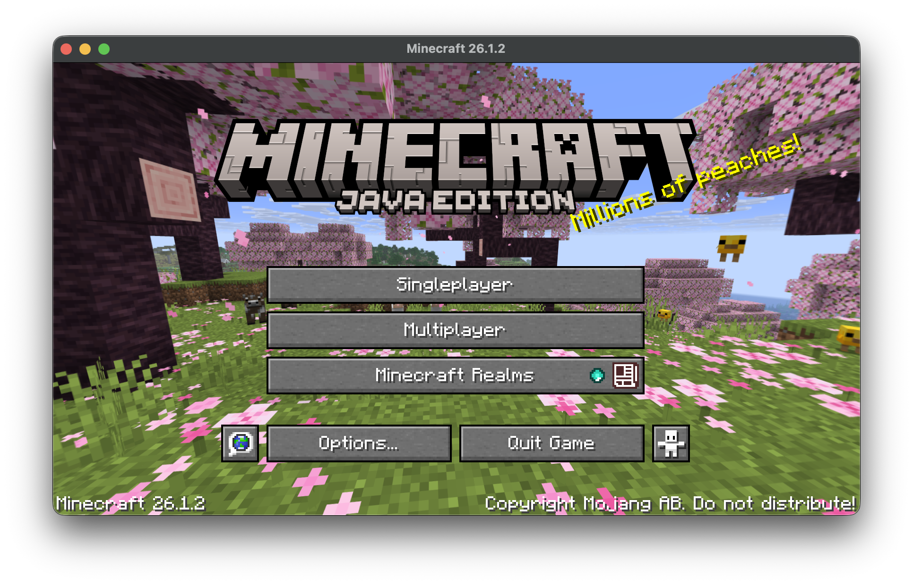

## HideModded Continued

From 1.15.2, if the game is modified, "(Modded)" will appear after the main menu game version number and "*" will appear in the game title bar.

This mod hides the "*" in the title bar of the game and the "(Modded)" after the game version number in the main menu.

This mod will **not** hide your mods from servers!

The downloads can be found under [Modrinth](https://modrinth.com/mod/hidemodded-continued), [Curseforge](https://www.curseforge.com/minecraft/mc-mods/hidemodded-continued) or under [GitHub Releases](https://github.com/DavidCGranger/HideModded/releases/latest).

This is a fork of [CiiLu](https://github.com/CiiLu)'s [original mod](https://github.com/CiiLu/HideModded) that updates it to support 26.1 and later.
The original mod should be used for 1.21.11 and earlier.

CiiLu's versions are available under the following sites to download:

[Modrinth](https://modrinth.com/mod/hidemodded)
[MC百科](https://www.mcmod.cn/class/13657.html)
[CurseForge](https://www.curseforge.com/minecraft/mc-mods/hideasterisk)

